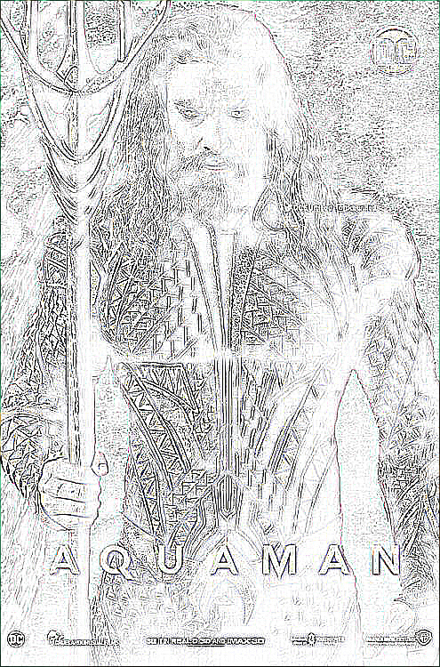
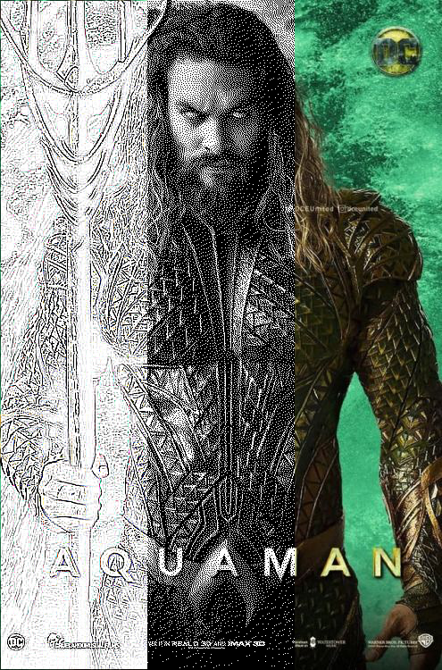

# Photo-Effect

Simple image manipulation with PIL, based on a previous work I did that would combine 3 cropped sections of an image into one.
For example here's an aquaman pic

> From this you can get the outline

> And a grey version

> Which is then combined with 1/3 sections from each into one image

To use this first make sure you have pip installed and the right version from the requirements file

> pip install -r req.txt

Then you can for convinience place the image in the original folder and from python running on the same folder

> from effect import processor
> processor('original/aquaman.jpg')

The function takes the filename and two additional parameters `delete_sections` and `delete_converts` that are by default are true so it deletes the converted images and sections once it makes the merged image, if set to false will not delete the images.